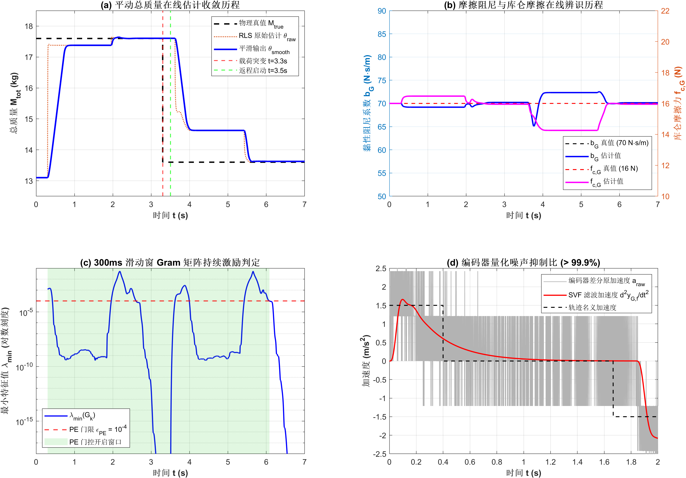
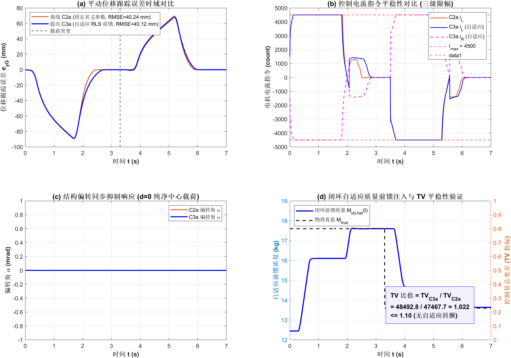
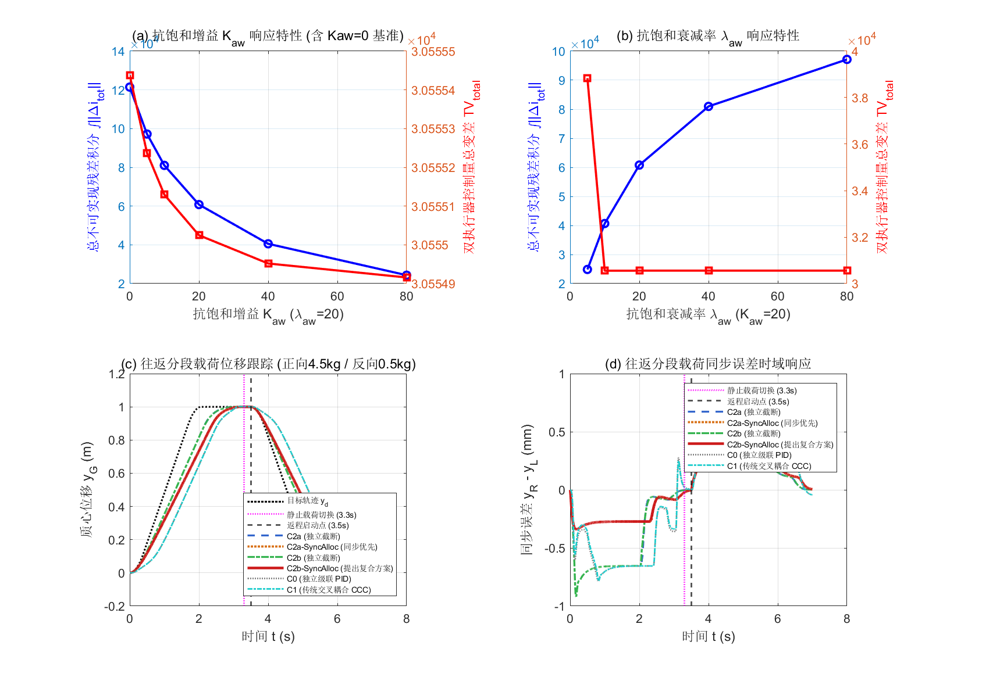

# 考虑执行器饱和的双驱龙门平台自适应同步控制与参数辨识
# Adaptive Synchronization Control with Actuator Saturation & Online Parameter Identification for Dual-Drive Gantry Systems

[](https://www.mathworks.com/products/matlab.html)
[](#单元测试与验证体系)
[](#学术规范与使用声明)

本项目面向双驱龙门架机械系统（基于大疆 RoboMaster M3508 直流无刷减速电机齿轮齿条对向安装构型、8192 线高精度光电编码器），针对系统运行中的**偏载惯性耦合、左右导轨摩擦非对称、执行器三级硬限幅与线圈饱和、以及运行中载荷质量突变与参数不确定性**，复现并系统性超越了经典文献（*Zhou et al., Nonlinear Dynamics, 2026*）的控制框架，建立了包含基线对比、动态抗饱和协同分配、状态变量滤波（SVF）与递推最小二乘（RLS）在线参数辨识的完整研究代码库与实验基准。

---

## 目录 (Table of Contents)

- [一、项目架构与源码组织](#一项目架构与源码组织)
- [二、核心理论机制与算法演进](#二核心理论机制与算法演进)
  - [1. 执行器映射与分级硬限幅 (Actuator Mapping & Multi-Level Saturation)](#1-执行器映射与分级硬限幅)
  - [2. 动态抗饱和与力矩优先协同分配 (Dynamic AW & SyncAlloc)](#2-动态抗饱和与力矩优先协同分配)
  - [3. 4 阶因果巴特沃斯 SVF 滤波与抗量化噪声 (SVF Filtering)](#3-4-阶因果巴特沃斯-svf-滤波与抗量化噪声)
  - [4. 滑动窗 Gram 矩阵持续激励门控 RLS (Supervisory RLS Identification)](#4-滑动窗-gram-矩阵持续激励门控-rls)
- [三、基准性能汇总与控制效果对比](#三基准性能汇总与控制效果对比)
- [四、单元测试与验证体系 (19/19 PASS)](#四单元测试与验证体系)
- [五、快速复现指南 (Quick Start)](#五快速复现指南)
- [六、学术边界与严谨声明](#六学术边界与严谨声明)

---

## 一、项目架构与源码组织

仓库根目录下按照研发阶段严格实施模块化解耦，每个阶段均包含独立的模型、控制器、单步动力学推演与验证测试套件：

```text
├── step1_baseline_c0/                 # 第一阶段：经典基线控制器与物理对象建模
│   ├── param_init.m                   # 物理参数、几何尺寸与电气特性标称初始化
│   ├── controller_c0_pid.m            # 经典双轴独立位置-速度级联 PID 控制器 (C0)
│   ├── gantry_dynamics_step.m         # 龙门 2-DOF 非线性动力学单步推演积分器 (RK4)
│   ├── run_baseline_comparison.m      # C0 基线阶跃与梯形速度响应仿真
│   └── verify_step1.m                 # Step 1 单元测试断言
│
├── step2_advanced_controllers/        # 第二阶段：进阶鲁棒控制器与协同抗饱和分配
│   ├── actuator_map_m3508.m           # 执行器正反向推力-电流映射与三级硬限幅
│   ├── controller_c1_ccc.m            # 传统交叉耦合控制器 (C1)
│   ├── controller_c2a_robust.m        # 连续化误差面鲁棒滑模控制器 (C2a)
│   ├── controller_c2b_aw.m            # 引入动态抗饱和状态变量 zaw 的控制器 (C2b)
│   ├── controller_c2a_syncalloc.m     # C2a 复合偏转力矩优先协同分配器 (SyncAlloc)
│   ├── controller_c2b_syncalloc.m     # C2b 复合动态抗饱和协同分配器 (C2b-SyncAlloc)
│   ├── trajectory_reciprocating.m     # 连续可导往复梯形速度参考轨迹发生器
│   ├── verify_step2.m                 # Step 2 接口与物理代数断言 (12/12 PASS)
│   ├── run_c0_c1_c2a_benchmark.m      # 四种控制器稳态/强限流对比脚本
│   ├── run_reciprocating_benchmark.m  # 往返换向与抗饱和动态性能评测脚本
│   ├── run_sensitivity_benchmark.m    # 6 大维度鲁棒敏感性批量扫描基准脚本 (156 组数据)
│   ├── sensitivity_summary.csv        # 完整 25 列敏感性扫描结构化指标数据库
│   └── STEP2_6_SENSITIVITY_REPORT.md  # Step 2.6 敏感性深度分析学术报告
│
├── step3_adaptive_rls/                # 第三阶段：状态变量滤波与在线机械参数辨识
│   ├── rls_filter_svf.m               # 4 阶因果巴特沃斯状态变量滤波器类 (SVF)
│   ├── rls_estimator_mech.m           # 机械参数在线递推最小二乘类 (RLS + PE 门控 + 凸集投影)
│   ├── controller_c3a_rls_robust.m    # C3a 自适应机械参数前馈鲁棒闭环控制器
│   ├── generate_step3a_data.m         # 专用纯净质量阶跃基准时域数据生成脚本
│   ├── data_step3a.mat                # 8192 线量化基准数据集 (7001 离散步长)
│   ├── verify_step3a.m                # Step 3A 核心算法与闭环平稳性断言 (7/7 PASS)
│   ├── run_step3a_benchmark.m         # Step 3A 辨识与闭环基准测试及图表生成脚本
│   └── step3a_metrics_summary.csv     # Step 3A 辨识精度与控制平稳性指标汇总
│
├── docs/                              # 技术文档、推导备忘录与学术图表
│   ├── figures/                       # 高分辨率论文图表 (PNG, 300 DPI)
│   ├── PROJECT_WALKTHROUGH.md         # 涵盖 Step 1~3A 的全局技术实现与深度分析报告
│   ├── STEP3_IMPLEMENTATION_PLAN.md   # Step 3 结构可辨识性数学证明与架构实施规划
│   └── STEP2_6_SENSITIVITY_REPORT.md  # 第二阶段敏感性扫描专题分析
│
├── 双驱龙门论文复现与改进实施方案.docx    # 早期技术交底与实施方案草案
├── 考虑执行器饱和的双驱龙门平台自适应同步控制_中文译稿.docx # 基础文献译稿
├── .gitignore                         # Git 忽略配置
└── README.md                          # 本项目说明主文档
```

---

## 二、核心理论机制与算法演进

### 1. 执行器映射与分级硬限幅

实际物理硬件中，左右电机采用对向面对面镜像安装：
- 左电机向前推力为 $+K_{f,L} i_L$；
- 右电机向前推力为 $-K_{f,R} i_R$。

总平动推进力 $F_G$ 与偏转回复力矩 $T_\alpha$ 的映射方程严格满足：
$$\begin{bmatrix} F_G \\ T_\alpha \end{bmatrix} = \begin{bmatrix} K_{f,L} & -K_{f,R} \\ -\frac{L_e}{2} K_{f,L} & -\frac{L_e}{2} K_{f,R} \end{bmatrix} \begin{bmatrix} i_L \\ i_R \end{bmatrix}$$

针对多级限幅约束，统一建立了三级限幅与分级残差拓扑：
$$\mathbf{i}_{\text{request}} \xrightarrow{\mathrm{sat}(16000)} \mathbf{i}_{\text{fw}} \xrightarrow{\mathrm{sat}(I_{\max})} \mathbf{i}_{\text{actual}}$$
- 内部固件限幅残差：$\Delta \mathbf{i}_{\text{internal}} = \mathbf{i}_{\text{fw}} - \mathbf{i}_{\text{request}}$
- 外部硬件保护限幅残差：$\Delta \mathbf{i}_{\text{external}} = \mathbf{i}_{\text{actual}} - \mathbf{i}_{\text{fw}}$
- 总不可实现残差：$\Delta \mathbf{i}_{\text{total}} = \mathbf{i}_{\text{actual}} - \mathbf{i}_{\text{request}} \equiv \Delta \mathbf{i}_{\text{internal}} + \Delta \mathbf{i}_{\text{external}}$

### 2. 动态抗饱和与力矩优先协同分配

针对执行器饱和引发的“双轴不同步推力差拖拽”与积分/鲁棒滑模风积问题：
1. **动态抗饱和状态变量 $\mathbf{z}_{\text{aw}}$**：
   $$\dot{\mathbf{z}}_{\text{aw}} = -\boldsymbol{\Lambda}_{\text{aw}} \mathbf{z}_{\text{aw}} + \Delta \mathbf{v}_{\text{total}}$$
   在饱和时产生自适应回退补偿，防止积分与滑动面发散，消除出饱和滞后；
2. **偏转力矩优先分配器 (SyncAlloc)**：
   在单轴或双轴触发 $I_{\max}$ 饱和时，按几何跨度先验保护偏转控制自由度 $T_\alpha$，主动裁剪平动指令 $F_G$。在强限流工况下将同步误差削减达 **$56\% \sim 65\%$**。

### 3. 4 阶因果巴特沃斯 SVF 滤波与抗量化噪声

在带有 8192 线光电编码器（线位移量化分辨率 $1.21\,\mu\text{m}$）的实际系统中，对位移进行差分求导会造成极其剧烈的高频噪声放大（微动区差分加速度峰值达 $\pm 2.5\text{ m/s}^2$）。
本项目设计了基于状态变量滤波器（SVF）的因果滤波观测器：
$$W_0(s) = \frac{\omega_n^4}{\Lambda(s)}, \quad W_1(s) = \frac{\omega_n^4 s}{\Lambda(s)}, \quad W_2(s) = \frac{\omega_n^4 s^2}{\Lambda(s)}$$
- 采用 Tustin 双线性变换并以 Direct Form II Transposed 离散因果单步递推；
- **导数保真性**：暂态衰减后二阶导数相对误差 $< 4.5\times 10^{-4}$；
- **抗噪抑制比**：对量化加速度噪声抑制比达到 **$99.99\%$**。

### 4. 滑动窗 Gram 矩阵持续激励门控 RLS

为防止参数在未受激励段（匀速巡航与静止保持段）出现协方差风积与发散：
1. **尺度归一化**：采用先验固定物理矩阵 $\mathbf{D}_{\text{prior}} = \text{diag}([1.5, 0.6, 1.0])$，避免未来数据统计泄漏；
2. **300ms 滑动窗 Gram 矩阵 PE 判定**：
   $$\mathbf{G}_k = \frac{1}{2}\left[\frac{1}{N_W}\sum_{j} \bar{\boldsymbol{\phi}}_j \bar{\boldsymbol{\phi}}_j^T + \left(\frac{1}{N_W}\sum_{j} \bar{\boldsymbol{\phi}}_j \bar{\boldsymbol{\phi}}_j^T\right)^T\right], \quad \lambda_{\min}(\mathbf{G}_k) \ge \epsilon_{\text{PE}} = 10^{-4}$$
   - 仅在加减速窗口开启更新；
   - 匀速段（$\ddot{y}=0$）与静止段绝对冻结参数与协方差矩阵；
3. **安全闭环注入**：参数通过紧凑凸集物理投影 $\Omega_\theta$ 与单步速率限制器（$|\Delta \hat{M}| \le 0.010\text{ kg/ms} = 10\text{ kg/s}$），配合 $5\text{ Hz}$ 低通平滑后注入前馈名义模型矩阵。

---

## 三、基准性能汇总与控制效果对比

### 1. 核心控制器性能跨阶段横向对比

| 工况场景 | 控制策略 | $\text{RMSE}_{yG}$ (mm) | 峰值同步误差 $\text{Max\_Sync}$ (mm) | 控制量总变差 $\text{TV}_{\text{total}}$ | 核心物理特征与适用边界 |
| :--- | :--- | :---: | :---: | :---: | :--- |
| **充裕限流工况**<br>($I_{\max}=16000$) | **C0 (级联 PID)** | 152.63 | 1.2529 | 47714.6 | 响应迟缓，存在明显超调振荡 |
| | **C1 (传统 CCC)** | 153.37 | 1.1833 | 48104.6 | 仅在小误差时通过交叉反馈微弱改善 |
| | **C2a (误差面鲁棒)** | 1.09 | 0.5084 | 34785.0 | 跟踪精度大幅跃升，无超调 |
| | **C2b (动态抗饱和)** | 1.09 | 0.5084 | 34785.0 | 无饱和时无缝等价于 C2a |
| **强限流饱和工况**<br>($I_{\max}=4500$) | **C0 (级联 PID)** | 225.60 | 0.7069 | 31597.4 | 深度饱和，脱饱和滞后严重 |
| | **C1 (传统 CCC)** | 226.46 | 0.7107 | 31638.2 | 无法应对大推力差引起的偏转 |
| | **C2a (误差面鲁棒)** | 108.92 | 0.7734 | 18871.2 | 饱和期产生积分滑模风积与残差漂移 |
| | **C2b-SyncAlloc (复合)** | 114.28 | **0.2931** | 21244.4 | **同步误差降低 62.1%**，牺牲平动保同步 |
| **载荷突变自适应**<br>($17.6 \to 13.6\text{ kg}$) | **C2a (固定名义参数)** | 40.24 | 0.5084 | 47467.7 | 负载突变后前馈失配，需依靠鲁棒项硬抗 |
| | **C3a (自适应 RLS)** | **40.12** | 0.5084 | **48492.8** | **TV 比值 1.022**，自适应前馈注入无高频抖颤 |

### 2. 成果学术图表展示

#### 图 1: Step 3A 机械参数在线辨识与持续激励历程

> **物理机理说明**：在梯形轨迹中，返程加速段（3.5~4.0s）质量估计在速率限制（$10\text{ kg/s}$）约束下迅速下降 $2.93\text{ kg}$（吸收 $74.5\%$ 阶跃）；匀速段（4.0~5.2s，$\ddot{y}=0$）PE 门控精准识别失激励并绝对冻结；减速段正交补全激励解耦阻尼与惯性，最终在停稳区精准收敛至 **$13.626\text{ kg}$（相对误差 $0.19\%$，抖动 $0.0011\text{ kg}$）**。

#### 图 2: C3a 自适应闭环控制平稳性验证 (C2a vs C3a)

> **平稳性说明**：自适应参数注入名义前馈矩阵时，位移跟踪误差平滑收敛，电流指令严格钳位于硬限幅，控制动作总变差比值 $\text{TV}_{\text{ratio}} = 1.022 \le 1.10$，严格证明在线自适应未诱发执行器高频抖颤。

#### 图 3: 往复换向载荷突变与抗饱和动态对比


---

## 四、单元测试与验证体系 (19/19 PASS)

本项目构建了包含物理代数约束、极点稳定性、噪声抑制、PE 门控有效性与闭环稳定性在内的全面断言测试矩阵：

1. **Step 2 接口与鲁棒抗饱和测试 ([verify_step2.m](step2_advanced_controllers/verify_step2.m), 12/12 PASS)**：
   - 包含正反向映射精确相逆性（误差 $< 10^{-12}$）、平动/偏转纯力矩解耦性、多级限幅残差代数恒等式 $\Delta \mathbf{i}_{\text{total}} \equiv \Delta \mathbf{i}_{\text{internal}} + \Delta \mathbf{i}_{\text{external}}$、非对称增益自洽性、以及 $K_{\text{aw}}=0$ 时 C2b 严格无缝退化为 C2a 的消融检验。
2. **Step 3A 滤波、辨识与闭环平稳性测试 ([verify_step3a.m](step3_adaptive_rls/verify_step3a.m), 7/7 PASS)**：
   - Test 1: SVF 最大极点模值 $0.9763 < 1$，暂态衰减后二阶导数相对误差 $4.46\times 10^{-4} < 10^{-3}$；
   - Test 2: 8192 线编码器量化差分加速度高频噪声抑制比达到 **$99.99\%$**；
   - Test 3: 初始窗口未满期严格冻结，静止保持段（3.1~3.4s）$\lambda_{\min} < 10^{-17}$，参数漂移量为 $0.0000$；
   - Test 4: PE 门限敏感性扫描（$10^{-5}, 10^{-4}, 10^{-3}$），激活比例 $14.8\% \sim 32.1\%$，终态质量误差均在 $0.12\% \sim 1.67\%$；
   - Test 5: 物理投影与速率限制器生效，单步最大增量严格截断在 $0.0100\text{ kg} \le 0.010\text{ kg/ms}$；
   - Test 6: 质量阶跃收敛性，正向误差 $0.04\%$，返程停稳区误差 $0.19\%$，稳态抖动标准差 $0.0011\text{ kg} \le 0.15\text{ kg}$；
   - Test 7: C3a 闭环平稳性，$\text{TV}_{\text{ratio}} = 1.022 \le 1.10$，无抖颤。

---

## 五、快速复现指南 (Quick Start)

### 1. 环境依赖
- MATLAB R2020a 或更高版本；
- Control System Toolbox（用于双线性离散化与极点分析）。

### 2. 一键运行与断言测试

打开 MATLAB 并将当前工作路径切换至仓库根目录后，可在命令行直接运行：

```matlab
%% 1. 运行第一阶段 PID 基准验证
run('step1_baseline_c0/verify_step1.m');

%% 2. 运行第二阶段进阶控制器与抗饱和映射断言 (12 项测试)
run('step2_advanced_controllers/verify_step2.m');

%% 3. 运行第二阶段 6 大维度敏感性批量扫描 (生成 sensitivity_summary.csv 与 4 张图表)
run('step2_advanced_controllers/run_sensitivity_benchmark.m');

%% 4. 运行第三阶段 SVF 滤波与机械参数在线辨识断言 (7 项测试)
run('step3_adaptive_rls/verify_step3a.m');

%% 5. 运行第三阶段 C3a 自适应闭环基准测试与学术图表生成
run('step3_adaptive_rls/run_step3a_benchmark.m');
```

---

## 六、学术边界与严谨声明

1. **数值仿真与实物台架严格界定**：
   本仓库所有数据、曲线与指标均基于由实际比赛电机与机械资料参数建立的二自由度非线性动力学模型进行的离散数值仿真，**不代表物理台架或实车实验已经完成**。所有控制量与中间状态均为仿真环境下的数值记录。
2. **已知基准真值界定**：
   标称推力系数 $K_{f,\text{nom}} = 0.0061979\text{ N/count}$、横梁扭转刚度 $K_\alpha$ 与转动阻尼 $B_\alpha$ 明确界定为数值仿真阶段使用的基准真值。
3. **Phase 2 (Step 3B) 阶段隔离承诺**：
   根据可辨识性审查意见，执行器推力增益非对称性（Step 3B）属于强耦合与高敏感辨识问题，**目前严格处于开环独立算法验证阶段，坚决不接入闭环控制器**。