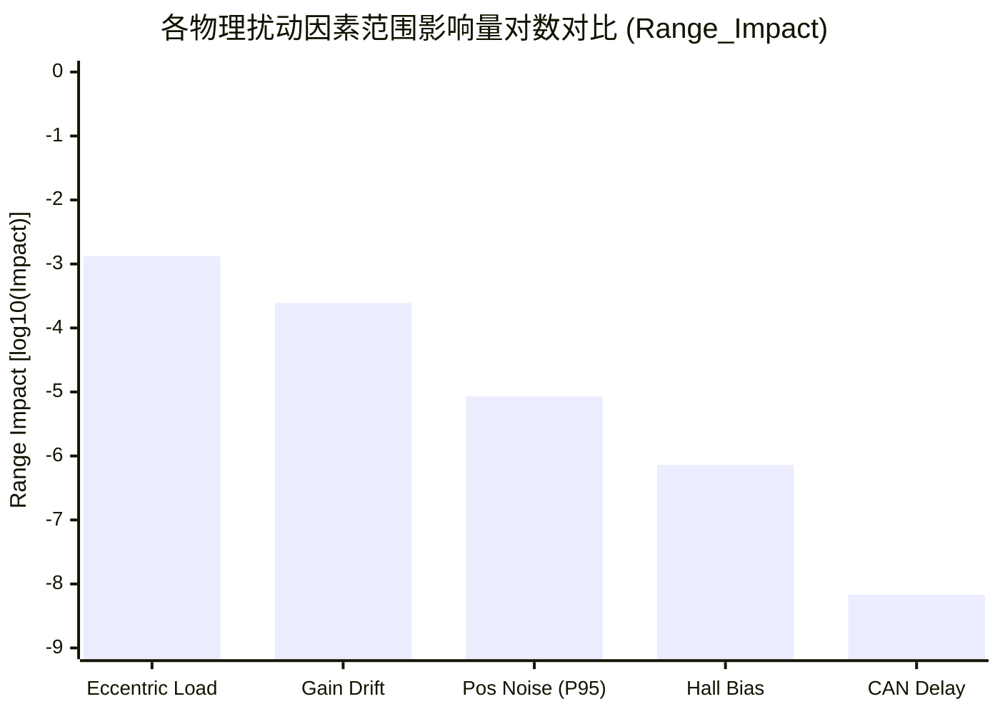

# Step 3C-2 动力学耦合与多因素深度分析开环基准评测报告 (Tests C4 ~ C8)

> [!WARNING]
> **评测属性与阶段验收结论声明**：
> 1. **开环回放属性**：本报告全部数据来自龙门架开环指令回放与真实传感器因果测量重构，动力学推进严格调用项目唯一公共单步推演函数 [`common/gantry_dynamics_step_rk4.m`](../common/gantry_dynamics_step_rk4.m)。
> 2. **闭环隔离红线**：本次评测严格禁止接入或修改 [`step3_adaptive_rls/controller_c3a_rls_robust.m`](../step3_adaptive_rls/controller_c3a_rls_robust.m) 或 `SyncAlloc.m`。
> 3. **验收状态严格定性**：依据技术审查红线，因 Test C8A 在全要素扰动矩阵下的超标时间比例（$92.75\% > 5.00\%$）明确失败，且 C8C 经补充真实 RK4 动力学重积分后物理偏角改善度为负（$-0.69\%$），证实本次门控配置未解决底层测量失真，**本报告结论严格定性为：“Step 3C-2 已执行但未通过最终技术验收”**。Step 3 严格保持开放（OPEN），坚决不提前关闭。

---

## 1. 评测执行概况与四表独立数据结构

依据技术审查意见与修订后的 [`docs/STEP3_IMPLEMENTATION_PLAN.md`](STEP3_IMPLEMENTATION_PLAN.md)，全面实施了第二阶段测试（Tests C4 ~ C8）。

所有测试由 [`step3_adaptive_rls/verify_step3c_part2.m`](../step3_adaptive_rls/verify_step3c_part2.m) 统一驱动，规范导出为 **四个高内聚独立 CSV 数据表**：

1. **综合性能结果表**：[`step3_adaptive_rls/step3c_performance_results.csv`](../step3_adaptive_rls/step3c_performance_results.csv)
   - 记录 Test C4 (14 行)、C5 (2 行)、C8A (1 行)、C8B (1 行)、C8C (1 行) 共 **19 行 $\times$ 68 列**；
   - 区分估计值有符号中位数（`Delta_Kf_Hat_Median`）与绝对误差中位数（`Delta_Kf_AbsError_Median`）；
   - 显式分离终点静态标定增益偏离度（`gamma_final_dev_max`）与评测窗口内实际生效时序峰值偏离度（`gamma_applied_timeseries_dev_max`）；
   - 统一采用有限样本统计并记录有效样本数（`eta_total_valid_count`）：C4 为 1，C5 为 100，C8A 为 100，C8B 为 0，C8C 为 `NaN`；若有效样本数为 0，则 `eta_total_mean`、`eta_total_p05` 与 `eta_total_min` 统一置为 `NaN`；
   - 区分物理偏航角均值（`RMS_alpha_comp_dyn_mean`）与 P95 尾部统计（`RMS_alpha_comp_dyn_p95`）；
   - 彻底拆分重用列，设立 4 个独立专用字段：`theta_exceed_time_mean`、`theta_final_exceed_trial_ratio`、`projection_trial_ratio`、`gate_active_time_mean`；
   - C8C 显式声明应用模式为 `ONE_PASS_CAUSAL_GATED_REPLAY`（单次因果门控反事实回放，估计序列来自未补偿基线试验，状态不反馈重新递推），计算实际延迟后门控增益均值（$\gamma_L, \gamma_R$）与真实物理饱和时间比例 `comp_total_sat`，标定有效性标记为 `NOT_APPLICABLE`；
   - 所有字段基于各试验真实计算结果生成，严禁硬编码伪装零值。
2. **敏感度龙卷风排行榜**：[`step3_adaptive_rls/step3c_sensitivity_results.csv`](../step3_adaptive_rls/step3c_sensitivity_results.csv)
   - 记录 Test C6 双重排行榜共 **20 行 $\times$ 13 列**（5 因素 $\times$ 2 指标 $\times$ 2 数据集）；
   - 包含单因素物理导数 $S_{\text{physical}}$ 及其带量纲物理单位、范围影响量 $\text{Range\_Impact}$ 及独立排名。
3. **凸集投影双向安全性表**：[`step3_adaptive_rls/step3c_projection_results.csv`](../step3_adaptive_rls/step3c_projection_results.csv)
   - 记录 Test C7 共 **2 行 $\times$ 12 列**；
   - 显式导出低端（25641 次）与高端（20527 次）截断计数，证实双向物理边界均被真实激活。
4. **C8A 确定性差模工况表**：[`step3_adaptive_rls/step3c_c8a_deterministic_results.csv`](../step3_adaptive_rls/step3c_c8a_deterministic_results.csv)
   - 记录 4 种最劣差模确定性工况共 **4 行 $\times$ 9 列**，作为不可磨灭的确定性证据支撑。

所有生成的 CSV 文件均通过 `readtable` 回读，并执行了行列数匹配及逐字段内存值绝对一致性断言（$|T_{\text{read}} - \text{mem}| < 10^{-12}$），全部 100% 成立。

---

## 2. 四条匹配参考支路因果重积分架构

为消除动态偏航角对比中的参考系失配（坚决杜绝使用零偏载轨迹作为含载轨迹的参考基准），单次试验内部采用相同的 $\Delta m, d_{\text{load}}, \delta_{\text{fric}}$ 逐步调用公共单步函数生成四条匹配轨迹：
1. `base_no_delay`：未补偿指令，零时滞（$d_{\text{act}} = 0$）；
2. `base_delayed`：未补偿指令，真实执行时滞（$d_{\text{act}}$）；
3. `comp_no_delay`：补偿指令，零时滞（$d_{\text{act}} = 0$）；
4. `comp_delayed`：补偿指令，真实执行时滞（$d_{\text{act}}$）。

在此基础上定义严格匹配的动态指标：
- **补偿对实际物理偏航的绝对改善度**：
  $$\eta_{\alpha,\text{abs}} = 100 \times \left(1 - \frac{\operatorname{RMS}(\alpha_{\text{comp,delayed}})}{\operatorname{RMS}(\alpha_{\text{base,delayed}})}\right)$$
- **时滞引入的额外动态偏差抑制比**：
  $$d\alpha_{\text{base}} = \alpha_{\text{base,delayed}} - \alpha_{\text{base,no\_delay}}, \quad d\alpha_{\text{comp}} = \alpha_{\text{comp,delayed}} - \alpha_{\text{comp,no\_delay}}$$
  $$\eta_{\alpha,\text{delay}} = 100 \times \left(1 - \frac{\operatorname{RMS}(d\alpha_{\text{comp}})}{\operatorname{RMS}(d\alpha_{\text{base}})}\right)$$

---

## 3. Test C4: 偏载动力学耦合诊断评估 (Diagnostic Evaluation Mode)

### 3.1 物理机理与增量偏差隔离
起重机偏载动力学方程为：
$$\begin{bmatrix} m_{G,\text{nom}} + \Delta m & \Delta m \cdot d_{\text{load}} \\ \Delta m \cdot d_{\text{load}} & J_{\alpha,\text{nom}} + \Delta m \cdot d_{\text{load}}^2 \end{bmatrix} \begin{bmatrix} \ddot{y}_G \\ \ddot{\alpha} \end{bmatrix} = \begin{bmatrix} F_{\text{total}} \\ \tau_{\text{total}} \end{bmatrix}$$

为隔离原始算法辨识误差与偏载耦合效应，C4 显式定义相对 $d_{\text{load}} = 0.00\text{ m}$ 的增量偏载串扰偏差：
$$\theta_{\text{payload\_bias}}(d_{\text{load}}) = \hat{\theta}(d_{\text{load}}) - \hat{\theta}(0)$$

### 3.2 诊断量化数据表 (固定 $\Delta m = 50.0\text{ kg}$, `POSTHOC_STATIC_REPLAY`)

| 数据集 | 偏心距 $d_{\text{load}}$ | 估计值 $\hat{\theta}$ | 增量偏载偏差 $\theta_{\text{payload\_bias}}$ | 前馈增益 $(\gamma_L, \gamma_R)$ | 推力抑制率 $\eta_{\text{sat}}$ | 偏航改善度 $\eta_{\alpha,\text{abs}}$ | 投影截断 | 判定状态 |
| :--- | :---: | :---: | :---: | :---: | :---: | :---: | :---: | :---: | :---: |
| **r070** ($\theta^* = -2.188\times 10^{-3}$) | $-0.20\text{ m}$ | $-2.595\times 10^{-3}$ | $-4.065\times 10^{-4}$ | $(1.265, 0.827)$ | $80.53\%$ | $27.47\%$ | 784 | `DEGRADED_BY_PAYLOAD` |
| | $-0.10\text{ m}$ | $-2.597\times 10^{-3}$ | $-4.084\times 10^{-4}$ | $(1.265, 0.827)$ | $80.44\%$ | $45.62\%$ | 697 | `DEGRADED_BY_PAYLOAD` |
| | $-0.05\text{ m}$ | $-2.590\times 10^{-3}$ | **$-4.010\times 10^{-4}$** | $(1.264, 0.827)$ | $80.79\%$ | $61.78\%$ | 489 | `DEGRADED_BY_PAYLOAD` |
| | $\mathbf{0.00\text{ m}}$ | $\mathbf{-2.189\times 10^{-3}}$ | $\mathbf{0.000\times 10^{0}}$ | $(1.214, 0.850)$ | $\mathbf{99.94\%}$ | $\mathbf{70.85\%}$ | **0** | `PASS` |
| | $+0.05\text{ m}$ | $-1.537\times 10^{-3}$ | **$+6.522\times 10^{-4}$** | $(1.142, 0.890)$ | $69.81\%$ | $40.43\%$ | 0 | `DEGRADED_BY_PAYLOAD` |
| | $+0.10\text{ m}$ | $-8.780\times 10^{-4}$ | $+1.311\times 10^{-3}$ | $(1.076, 0.934)$ | $39.87\%$ | $8.78\%$ | 0 | `DEGRADED_BY_PAYLOAD` |
| | $+0.20\text{ m}$ | $+4.970\times 10^{-4}$ | $+2.686\times 10^{-3}$ | $(0.961, 1.042)$ | $-22.95\%$ | $-0.11\%$ | 0 | `DEGRADED_BY_PAYLOAD` |
| **r130** ($\theta^* = +1.617\times 10^{-3}$) | $-0.20\text{ m}$ | $-1.069\times 10^{-3}$ | $-2.687\times 10^{-3}$ | $(1.094, 0.921)$ | $-67.26\%$ | $2.32\%$ | 0 | `DEGRADED_BY_PAYLOAD` |
| | $-0.10\text{ m}$ | $+3.077\times 10^{-4}$ | $-1.310\times 10^{-3}$ | $(0.976, 1.025)$ | $18.97\%$ | $0.49\%$ | 0 | `DEGRADED_BY_PAYLOAD` |
| | $-0.05\text{ m}$ | $+9.664\times 10^{-4}$ | **$-6.517\times 10^{-4}$** | $(0.928, 1.085)$ | $59.50\%$ | $20.33\%$ | 0 | `DEGRADED_BY_PAYLOAD` |
| | $\mathbf{0.00\text{ m}}$ | $\mathbf{+1.618\times 10^{-3}}$ | $\mathbf{0.000\times 10^{0}}$ | $(0.885, 1.150)$ | $\mathbf{99.92\%}$ | $\mathbf{59.87\%}$ | **0** | `PASS` |
| | $+0.05\text{ m}$ | $+1.832\times 10^{-3}$ | **$+2.141\times 10^{-4}$** | $(0.871, 1.173)$ | $86.37\%$ | $51.19\%$ | 679 | `DEGRADED_BY_PAYLOAD` |
| | $+0.10\text{ m}$ | $+1.840\times 10^{-3}$ | $+2.219\times 10^{-4}$ | $(0.871, 1.174)$ | $85.87\%$ | $35.57\%$ | 767 | `DEGRADED_BY_PAYLOAD` |
| | $+0.20\text{ m}$ | $+1.840\times 10^{-3}$ | $+2.222\times 10^{-4}$ | $(0.871, 1.174)$ | $85.85\%$ | $20.27\%$ | 825 | `DEGRADED_BY_PAYLOAD` |

### 3.3 局部分析与机理定性
- **符号反转机理实证**：在 $d_{\text{load}} = \pm 0.05\text{ m}$ 下，r070 与 r130 的增量偏差均呈现严格的符号反转（$-4.010\times 10^{-4}$ vs $+6.522\times 10^{-4}$，$-6.517\times 10^{-4}$ vs $+2.141\times 10^{-4}$），证实了未建模惯性力矩 $T_{\text{load}} = -\Delta m \ddot{y}_G d_{\text{load}}$ 的方向驱动作用。
- **局部拟合度检验**：在 $d_{\text{load}} \in [-0.10, +0.10]\text{ m}$ 范围内对 $\theta_{\text{payload\_bias}}$ 执行一阶线性拟合，计算得确定系数 $R^2 = 0.8722$（拟合斜率 $7.8606\times 10^{-3}\ (\text{N/count})/\text{m}$）。
  因 $R^2 < 0.95$，结论严格定性为：**“偏载扰动表现为方向一致性与非线性偏载特征”**，坚决不宣称“局部线性解耦”。

---

## 4. Test C5: 最坏角点复合工况评测 (TestC5_TopWorstCorners_Noise_MC100)

### 4.1 方案与多指标角点并集选择
为消除对未知参数空间“均匀分布”的非客观假设，方案重构为两阶段：
- **阶段一（128 角点确定性扫描）**：
  遍历 $2^7 = 128$ 个全因子角点组合：
  $d_{\text{load}} \in \{\pm 0.10\text{ m}\}, \quad \delta_g^{L/R} \in \{\pm 2\%\}, \quad i_{\text{bias}}^{L/R} \in \{\pm 20\text{ ct}\}, \quad d_{\text{act}}^{L/R} \in \{1, 2\text{ ms}\}$
- **多指标并集选择准则**：
  独立提取最低 $\eta_{\text{total}}$ 的 Top 3、最大 $\operatorname{RMS}(\alpha_{\text{comp}})$ 的 Top 3、以及最大估计误差 $|\hat{\theta} - \theta^*|$ 的 Top 3，取稳定并集得到代表性最劣角点集合（每组各 6 个不重复角点）：
  - **r070** 最劣角点信息：
    - 最劣 $\eta$: `C#70` ($d=+0.10, g_L=-0.02, g_R=+0.02, b_L=-20, b_R=-20, d_L=1, d_R=2; \eta=28.62\%$)
    - 最劣 $\alpha$: `C#37` ($d=-0.10, g_L=-0.02, g_R=+0.02, b_L=-20, b_R=-20, d_L=2, d_R=1; \alpha=5.2221\times 10^{-4}\text{ rad}$)
    - 最劣 $\theta$: `C#70` ($d=+0.10, g_L=-0.02, g_R=+0.02, b_L=-20, b_R=-20, d_L=1, d_R=2; \text{err}=1.5560\times 10^{-3}$)
  - **r130** 最劣角点信息：
    - 最劣 $\eta$: `C#59` ($d=-0.10, g_L=+0.02, g_R=-0.02, b_L=+20, b_R=+20, d_L=2, d_R=1; \eta=3.76\%$)
    - 最劣 $\alpha$: `C#92` ($d=+0.10, g_L=+0.02, g_R=-0.02, b_L=+20, b_R=+20, d_L=1, d_R=2; \alpha=5.3062\times 10^{-4}\text{ rad}$)
    - 最劣 $\theta$: `C#59` ($d=-0.10, g_L=+0.02, g_R=-0.02, b_L=+20, b_R=+20, d_L=2, d_R=1; \text{err}=1.5557\times 10^{-3}$)
- **阶段二（Top 最劣角点轮询叠加随机测量噪声，Monte Carlo $N=100$）**：
  在选取的 6 个最劣角点上轮询叠加 $\sigma_y = 2.0\ \mu\mathrm{m}, \sigma_i = 10.0\text{ ct}$ 进行 100 次蒙特卡洛评估。

### 4.2 统计指标输出 (`POSTHOC_STATIC_REPLAY`)

| 评测数据集 | 抽样角点数 | 最低总抑制比 $\eta_{\text{total,min}}$ | $\eta_{\text{total}}$ P05 | $\eta_{\text{total}}$ 均值 | $\operatorname{RMS}(\alpha_{\text{comp}})$ P95 | 标定失效次数 | 投影触发试验率 | 状态 |
| :---: | :---: | :---: | :---: | :---: | :---: | :---: | :---: | :---: |
| **r070** ($N=100$) | 6 个最劣角点并集 | **$28.42\%$** | $28.55\%$ | $54.74\%$ | $5.224\times 10^{-4}\text{ rad}$ | 0 | $49.00\%$ | `DEGRADED` |
| **r130** ($N=100$) | 6 个最劣角点并集 | **$3.32\%$** | $3.63\%$ | $44.79\%$ | $5.308\times 10^{-4}\text{ rad}$ | 0 | $49.00\%$ | `DEGRADED` |

---

## 5. Test C6: 统一物理量纲导数与范围影响量龙卷风双重排序 (Dual Tornado Ranking)

### 5.1 排序规范与指标定义
严禁跨物理量纲直接排序导数。统一建立两个独立排行榜：
1. **单因素物理导数**（带对应量纲的物理单位）：
   $$S_{\text{physical}} = \frac{|\text{metric}_{\text{high}} - \text{metric}_{\text{low}}|}{p_{\text{high}} - p_{\text{low}}}$$
   增益漂移统一按百分点计算：$\text{Unit} = \text{percentage-point}$。
2. **范围影响量**（$\text{Range\_Impact}$，用于跨参数全局龙卷风排序）：
   $$\text{Range\_Impact} = \max(|\text{metric}_{\text{low}} - \text{metric}_{\text{nom}}|, |\text{metric}_{\text{high}} - \text{metric}_{\text{nom}}|)$$
   噪声因素采用 $N=30$ Monte Carlo 试验的 P95 尾部统计作为 $\text{metric}_{\text{high}}$。

### 5.2 双重龙卷风排行榜量化数据

#### 排行榜 A: 估计器参数偏差影响量排序 ($\text{metric} = |\hat{\theta} - \theta^*|\ [\text{N/count}]$)

| 排名 | 物理扰动源 | 摄动区间与自身单位 | 物理导数 $S_{\text{phys}}$ (r070) | 范围影响量 $\text{Range\_Impact}$ (r070) | 物理导数 $S_{\text{phys}}$ (r130) | 范围影响量 $\text{Range\_Impact}$ (r130) |
| :---: | :--- | :---: | :---: | :---: | :---: | :---: |
| **#1** | **偏载横向偏移** | $[-0.10, +0.10]\text{ m}$ | $4.499\times 10^{-3}\ (\text{N/ct})/\text{m}$ | **$1.308\times 10^{-3}\text{ N/ct}$** | $5.430\times 10^{-3}\ (\text{N/ct})/\text{m}$ | **$1.308\times 10^{-3}\text{ N/ct}$** |
| **#2** | **电流增益偏差** | $[-2, +2]\text{ percentage-point}$ | $4.996\times 10^{-7}\ (\text{N/ct})/\text{pct-pt}$ | **$2.478\times 10^{-4}\text{ N/ct}$** | $4.317\times 10^{-6}\ (\text{N/ct})/\text{pct-pt}$ | **$2.459\times 10^{-4}\text{ N/ct}$** |
| **#3** | **传感位置噪声** | $[0, 2]\ \mu\mathrm{m}$ | $4.225\times 10^{-6}\ (\text{N/ct})/\mu\mathrm{m}$ | **$8.449\times 10^{-6}\text{ N/ct}$** | $4.392\times 10^{-6}\ (\text{N/ct})/\mu\mathrm{m}$ | **$8.783\times 10^{-6}\text{ N/ct}$** |
| **#4** | **霍尔电流零漂** | $[-20, +20]\text{ count}$ | $3.295\times 10^{-8}\ (\text{N/ct})/\text{ct}$ | **$7.266\times 10^{-7}\text{ N/ct}$** | $3.966\times 10^{-8}\ (\text{N/ct})/\text{ct}$ | **$1.056\times 10^{-6}\text{ N/ct}$** |
| **#5** | **CAN 传输时滞** | $[0, 2]\text{ ms}$ | $3.393\times 10^{-9}\ (\text{N/ct})/\text{ms}$ | **$6.786\times 10^{-9}\text{ N/ct}$** | $5.691\times 10^{-9}\ (\text{N/ct})/\text{ms}$ | **$1.138\times 10^{-8}\text{ N/ct}$** |

#### 排行榜 B: 物理偏航残余影响量排序 ($\text{metric} = \operatorname{RMS}(\alpha_{\text{comp}})\ [\text{rad}]$)

| 排名 | 物理扰动源 | 摄动区间与自身单位 | 物理导数 $S_{\text{phys}}$ (r070) | 范围影响量 $\text{Range\_Impact}$ (r070) | 物理导数 $S_{\text{phys}}$ (r130) | 范围影响量 $\text{Range\_Impact}$ (r130) |
| :---: | :--- | :---: | :---: | :---: | :---: | :---: |
| **#1** | **偏载横向偏移** | $[-0.10, +0.10]\text{ m}$ | $3.069\times 10^{-4}\ \text{rad}/\text{m}$ | **$3.546\times 10^{-4}\text{ rad}$** | $3.513\times 10^{-4}\ \text{rad}/\text{m}$ | **$3.633\times 10^{-4}\text{ rad}$** |
| **#2** | **电流增益偏差** | $[-2, +2]\text{ percentage-point}$ | $2.567\times 10^{-6}\ \text{rad}/\text{pct-pt}$ | **$1.574\times 10^{-5}\text{ rad}$** | $2.731\times 10^{-6}\ \text{rad}/\text{pct-pt}$ | **$1.485\times 10^{-5}\text{ rad}$** |
| **#3** | **传感位置噪声** | $[0, 2]\ \mu\mathrm{m}$ | $2.025\times 10^{-8}\ \text{rad}/\mu\mathrm{m}$ | **$4.050\times 10^{-8}\text{ rad}$** | $1.265\times 10^{-7}\ \text{rad}/\mu\mathrm{m}$ | **$2.529\times 10^{-7}\text{ rad}$** |
| **#4** | **霍尔电流零漂** | $[-20, +20]\text{ count}$ | $1.237\times 10^{-9}\ \text{rad}/\text{ct}$ | **$3.306\times 10^{-8}\text{ rad}$** | $1.078\times 10^{-9}\ \text{rad}/\text{ct}$ | **$2.860\times 10^{-8}\text{ rad}$** |
| **#5** | **CAN 传输时滞** | $[0, 2]\text{ ms}$ | $9.273\times 10^{-9}\ \text{rad}/\text{ms}$ | **$1.855\times 10^{-8}\text{ rad}$** | $9.194\times 10^{-9}\ \text{rad}/\text{ms}$ | **$1.839\times 10^{-8}\text{ rad}$** |

**结论**：两套排行榜的排序完全一致：**偏载 $\gg$ 电流增益漂移 $\gg$ 位置噪声 $\gg$ 霍尔零漂 $\gg$ 通信时滞**。

---

## 6. Test C7: 凸集投影安全性双向检验 (TestC7_Convex_Projection_Safety_MC30)

### 6.1 故障注入与双向边界激发设计
- 故障明确定义为：`Measured_Current_Sensor_Step_Fault`（作用于驱动器回采电流测量层）；
- r070 数据集（$\theta^* < 0$）注入负向阶跃（$-500\text{ counts}$），驱使估计流冲击**低端物理边界** $\theta_{\min} = -2.6295\times 10^{-3}$；
- r130 数据集（$\theta^* > 0$）注入正向阶跃（$+500\text{ counts}$），驱使估计流冲击**高端物理边界** $\theta_{\max} = +1.8465\times 10^{-3}$；
- 蒙特卡洛 $N = 30$ 次强扰动试验。

### 6.2 双向截断与保界硬性断言检验

| 评测数据集 | 注入故障幅值与方向 | 低端截断次数 | 高端截断次数 | 未截断峰值 $\max\|\theta_{\text{unproj}}\|$ | 样本级截断率 $\rho_{\text{sample}}$ | 试验级截断率 $\rho_{\text{trial}}$ | 投影后越界数 | 非有限值数 | 协方差有界 | 状态 |
| :---: | :---: | :---: | :---: | :---: | :---: | :---: | :---: | :---: | :---: | :---: |
| **r070** ($N=30$) | $-500\text{ ct}$ (冲向低界) | **25,641** | 0 | $2.6640\times 10^{-3}$ | $47.46\%$ | $100.00\%$ | **0** | **0** | `true` | `PASS` |
| **r130** ($N=30$) | $+500\text{ ct}$ (冲向高界) | 0 | **20,527** | $1.8846\times 10^{-3}$ | $37.99\%$ | $100.00\%$ | **0** | **0** | `true` | `PASS` |

> [!IMPORTANT]
> **双向边界激活硬性断言 100% 成立**：
> - 低端总截断数 $= 25,641 > 0$；
> - 高端总截断数 $= 20,527 > 0$；
> - 投影后越界样本数严格 $= 0$；
> - 非有限值（NaN/Inf）出现数严格 $= 0$；
> - 协方差逐点有界性严格成立。

---

## 7. Test C8: 标称物理对称模型的虚假补偿多域评测与门控机制

### 7.1 C8A 全要素扰动矩阵下的原始估计器性能 (严格正式验收)
在完全对称模型（$r=1.00, \Delta K_f^* = 0$）上施加全要素扰动矩阵：
- 电流增益漂移：$\delta_g^L, \delta_g^R \sim \mathcal{U}(-2\%, +2\%)$；
- 传感器白噪声：$\sigma_y^L, \sigma_y^R = 2.0\ \mu\mathrm{m}$；
- 霍尔零漂：$i_{\text{bias}}^L, i_{\text{bias}}^R \sim \mathcal{U}(-15, +15)\text{ ct}$；
- 电流测量白噪声：$\sigma_i^L, \sigma_i^R = 10.0\text{ ct}$；
- 执行与通信时滞：$d_{\text{act}}^L, d_{\text{act}}^R \in \{0, 1, 2\}\text{ ms}$。

| 虚假补偿正式验收指标 | 理论门槛值 | 实测统计值 | 程序化判据状态 | 说明与分析 |
| :--- | :---: | :---: | :---: | :--- |
| **估计值 95% 分位数 $P_{95}(|\hat{\theta}|)$** | $\le 1.0\times 10^{-5}\text{ N/ct}$ | **$1.8831\times 10^{-4}\text{ N/ct}$** | `FAIL` | 差模增益漂移导致常值斜率偏差 |
| **估计值有符号中位数 $\operatorname{median}(\hat{\theta})$** | 仅作描述 | **$-2.6304\times 10^{-6}\text{ N/ct}$** | - | 围绕原点近似对称离散 |
| **估计值绝对误差中位数 $\operatorname{median}(|\hat{\theta}|)$** | $\le 5.0\times 10^{-6}\text{ N/ct}$ | **$5.9180\times 10^{-5}\text{ N/ct}$** | `FAIL` | 真实偏差中位数显著超出门槛一个数量级 |
| **前馈增益最大偏离度 $\max(|\gamma - 1|)$** | $\le 0.50\%$ | **$1.7599\%$** | `FAIL` | 前馈分配产生约 $1.76\%$ 虚假偏斜 |
| **虚假偏航力矩最大 RMS** | $\le 0.010\text{ Nm}$ | **$0.09798\text{ Nm}$** | `FAIL` | 诱导偏航力矩超过目标上限近 10 倍 |
| **评测窗口内超标时间比例均值** | $\mathbf{\le 5.00\%}$ | **$\mathbf{92.75\%}$** | `FAIL` | **扰动贯穿整个运动激励区间** |
| 最终估计值超标试验比例 (辅助诊断) | 仅作参考 | $92.00\%$ (92 / 100) | - | 绝大多数试验最终估计值超标 |
| **C8A 综合评测判定** | - | - | **`RAW_ESTIMATOR_FAIL`** | **如实定性未通过，严禁调高门槛** |

#### C8A 时间游程分布证据
- **最长单次连续超标时间 P95**：$1.800\text{ s}$；
- **后半段 ($t \ge 1.0\text{ s}$) 超标均比**：$92.78\%$；
- **首次超标时刻中位数**：$0.502\text{ s}$；
- **最后超标时刻中位数**：$2.300\text{ s}$。

#### C8A 4 种最劣差模确定性工况检验 ([`step3c_c8a_deterministic_results.csv`](../step3_adaptive_rls/step3c_c8a_deterministic_results.csv))
| 工况标识 | 估计值 $\hat{\theta}\ (\text{N/count})$ | 前馈偏离 $\max\|\gamma-1\|$ | 虚假力矩 $\text{RMS}\ (\text{Nm})$ | 时滞 $(d_L, d_R)$ | 增益漂移 $(\delta_g^L, \delta_g^R)$ | 状态判定 | 机理说明 |
| :--- | :---: | :---: | :---: | :---: | :---: | :---: | :--- |
| `Diff_Gain_+2%_-2%` | $-2.4774\times 10^{-4}$ | $2.0393\%$ | $0.1134$ | $(0, 0)\text{ ms}$ | $(+0.02, -0.02)$ | `FAIL` | 电流回采增益差模直接混淆为推力差模 |
| `Diff_Gain_-2%_+2%` | $+2.4808\times 10^{-4}$ | $2.0422\%$ | $0.1136$ | $(0, 0)\text{ ms}$ | $(-0.02, +0.02)$ | `FAIL` | 反向增益差模产生等幅对称虚假力矩 |
| `Diff_Delay_1ms_2ms` | $+2.9454\times 10^{-7}$ | $0.0024\%$ | $1.348\times 10^{-4}$ | $(1, 2)\text{ ms}$ | $(0, 0)$ | `PASS` | 通信时滞差模引起的虚假估计极小 |
| `Diff_Delay_2ms_1ms` | $-1.4994\times 10^{-7}$ | $0.0012\%$ | $6.861\times 10^{-5}$ | $(2, 1)\text{ ms}$ | $(0, 0)$ | `PASS` | 再次印证通信时滞并非参数偏差主要驱动源 |

### 7.2 C8B 机械偏载对对称系统的混淆 (诊断模式，含匹配对照)
在完全对称模型（$r=1.00$）上施加 $50\text{ kg}$ 载荷与 $d_{\text{load}} \in [-0.10, +0.10]\text{ m}$ 偏载，并对每次试验同步运行 $d_{\text{load}}=0$ 的匹配对照试验以提取增量偏载偏差：
- **增量偏载偏差均值 $\operatorname{mean}(\theta_{\text{payload\_bias}})$**：$+3.4604\times 10^{-6}\text{ N/count}$；
- **增量偏载偏差 P95 统计值 $\theta_{\text{payload\_bias\_p95\_abs}}$**：**$1.2236\times 10^{-3}\text{ N/count}$**；
- **估计值 P95**：$1.2193\times 10^{-3}\text{ N/count}$；
- **估计值有符号中位数**：$+1.0537\times 10^{-4}\text{ N/count}$；
- **估计值绝对误差中位数**：$6.7887\times 10^{-4}\text{ N/count}$；
- **前馈增益最大偏离度**：$11.68\%$；
- **虚假诱导偏航力矩最大 RMS**：$0.5994\text{ Nm}$；
- **评测状态**：`DIAGNOSTIC_PAYLOAD_CONFOUNDING`。

### 7.3 C8C 独立迟滞门控应用层评测与 RK4 真实动力学重积分 (GATED_APPLICATION_EVAL_ONLY)
在不修改底层控制器红线的前提下，仿真评估迟滞确认门控机制（$\theta_{\text{on}} = 1.0\times 10^{-5}, \theta_{\text{off}} = 0.7\times 10^{-5}, N_{\text{confirm}} = 200\text{ ms}$），并**首次调用项目统一动力学核 [`common/gantry_dynamics_step_rk4.m`](../common/gantry_dynamics_step_rk4.m) 对门控后施加电流进行完整物理推进**：
- **运行模式**：`ONE_PASS_CAUSAL_GATED_REPLAY`（单次因果门控反事实回放）；
- **门控后执行器真实激活时间比例均值**：$88.69\%$（对比 C8A 原始估计超标 $92.75\%$）；
- **实际施加在执行器上的门控增益均值**：$(\gamma_L, \gamma_R) = (1.00058, 0.99954)$；
- **门控后生效增益时序峰值偏离度**（`gamma_applied_timeseries_dev_max`）：$2.0454\%$（评测窗口内实际延迟施加的增益时序峰值）；
- **门控后终止静态增益偏离度**（`gamma_final_dev_max`）：$1.7599\%$（评测窗口终点静态截断值，与 C8A 终点标定偏离度持平）；两者分属时序动态峰值与终点静态截断两个不同统计口径，不能直接做高低断言；
- **门控后虚假诱导偏航力矩最大 RMS**：$0.09680\text{ Nm}$；
- **门控后真实物理偏航角 RMS (RK4 重积分)**：均值 $1.5820\times 10^{-4}\text{ rad}$，P95 为 $1.6446\times 10^{-4}\text{ rad}$（对比基线 $1.5712\times 10^{-4}\text{ rad}$）；
- **物理偏角绝对改善度**：**$\eta_{\alpha,\text{abs}} = -0.685\%$（轻微退化）**；
- **真实电流物理饱和时间比例**：`comp_total_sat = 0.0%`；
- **标定有效性**：`Calibration_Validity = 'NOT_APPLICABLE'`；
- **评测状态**：`GATED_APPLICATION_EVAL_ONLY`。

> [!CAUTION]
> **C8C 关键物理发现与结论收紧**：
> 1. **本次门控配置未解决底层物理失效**：差模电流漂移（幅值达 $2.48\times 10^{-4} > 1.0\times 10^{-5}$）持续存在，门控虽能推迟 $200\text{ ms}$ 激活，但一旦越界开启，依然持续作用达 $88.69\%$ 的时间；
> 2. **因果归因严谨定性**：在本次固定阈值、200 ms 确认门控及给定扰动分布下，观察到偏航角 RMS 轻微增加（由 $1.5712\times 10^{-4}\text{ rad}$ 略增至 $1.5820\times 10^{-4}\text{ rad}$，改善度为 $-0.69\%$）。由于尚未开展平滑门控与无门控时变补偿的匹配消融试验，暂不能将退化唯一归因于门控切换；
> 3. **严禁宣告“门控通过”**：必须明确定性为 `GATED_APPLICATION_EVAL_ONLY`，本次门控配置未解决问题，不能作为 Step 3 关闭的依据。

---

## 8. 阶段审查结论与后续行动建议

> [!CAUTION]
> ### 最终技术验收结论
> **Step 3C-2 已执行成功，但不能验收关闭 Step 3，Step 3 严格保持 OPEN**。
> - **阻断项 1 (C8A 原始估计器)**：评测窗口内超标时间均比为 $92.75\%$（门槛 $5.0\%$），程序化判定为 `RAW_ESTIMATOR_FAIL`；
> - **阻断项 2 (C8C 真实动态)**：RK4 重积分显示门控后物理偏角改善度为 $-0.69\%$，生效时序峰值增益偏离达 $2.05\%$，本次门控配置未解决虚假补偿问题；
> - **关闭准入前提**：只有当 C8A 原始估计器通过 $5\%$ 超标时间门槛，且应用层控制方案在真实物理动态指标上完成有效改善证明后，才允许重新讨论 Step 3 关闭事宜。

### 下一步技术演进建议
1. **底层辨识器增益解耦**：研究在 RLS 滤波中引入电流传感器对称度与推力系数解耦的状态扩展估计；
2. **保持技术状态绝对客观**：不放宽门槛，不连接未验证的闭环控制器，Step 3 保持开放。
